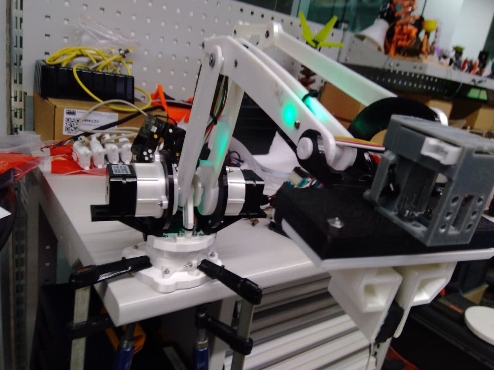
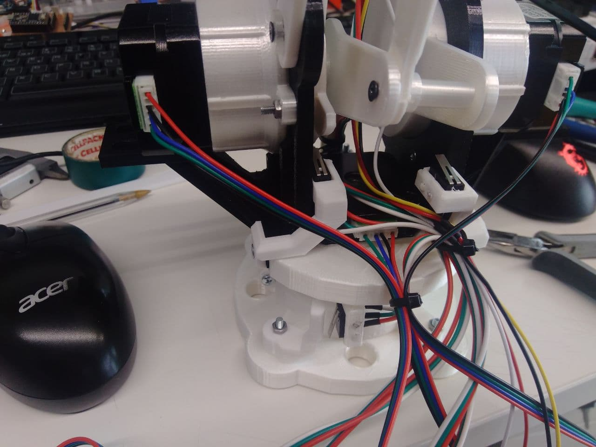
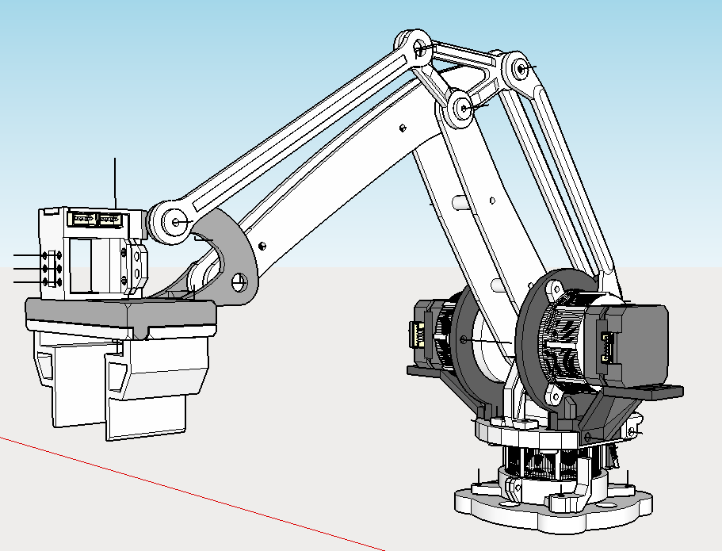
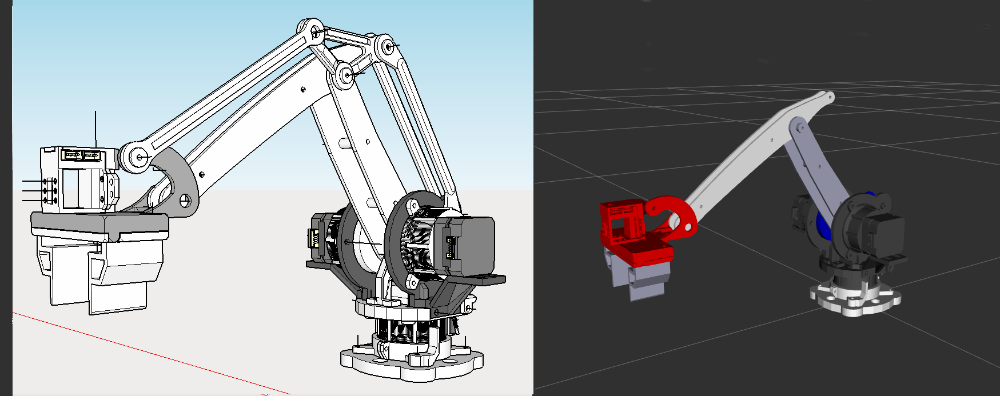
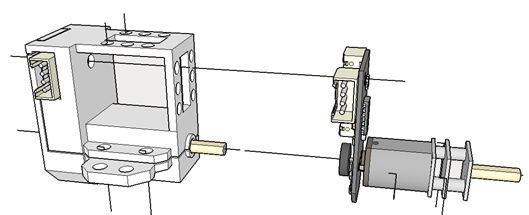
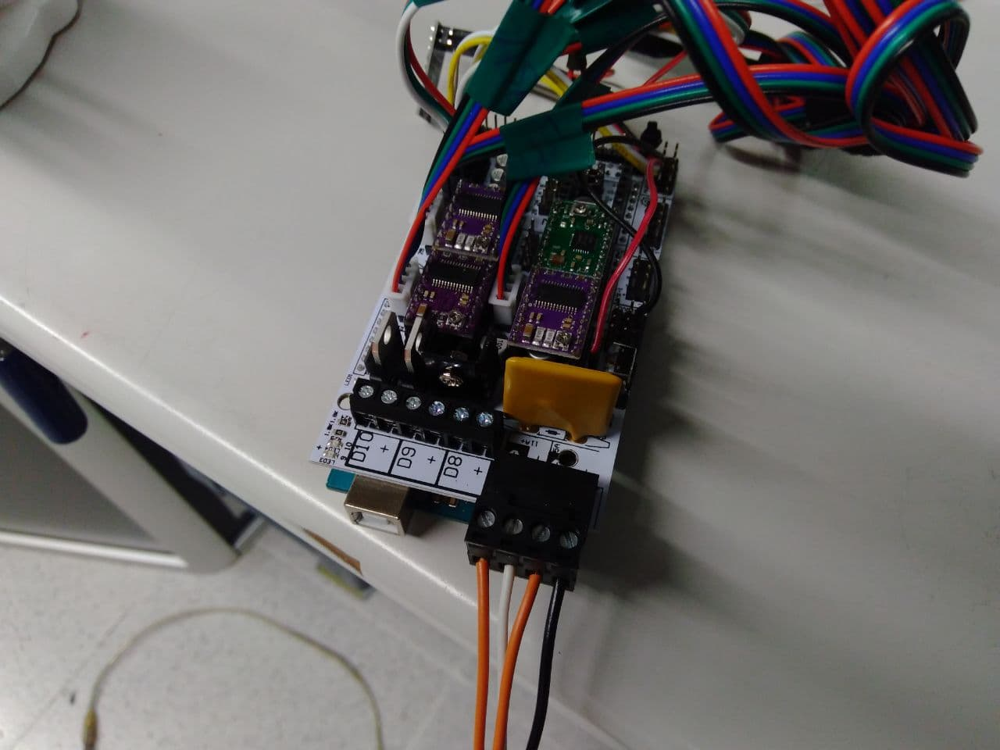

# Armpap
Armpa: Robotic arm 4DOF with ROS Noetic

This repository hosts the source code for the ROS < ARMPAP > package.

 

This is part of the practices that I am doing in the course Mastering Robot orerating System ROS in the ROBOCADEMY

## Description ##

The robot type is a open-hardware Arm with 4 degrees of freedom

- Arduino mega 2560.
- Ramps 1.4 by reprap.
- Driver A4988
- wifi with ESP8266.
- Motor Nema 17 24mm x 3.
- Planetary reduction gearbox 37:1
- Gripper Motor i2c.
- RGB Smart NeoPixel x 3.

### Contents ###

  - armpap_description : xacro files and meshes
  
  - armpap_control : Crontrol file, program to connect with the real robot and test with keyboard
  
  - armpap_gazebo : Simulation 
  
  - armpap_rqt_py : Plugin to control simulation and real robot
  
  - armpap_msg: specific ros messages for this type of robot.
  
  - pictures

## Key concepts covered ##
- the goal of this exercise is to get the xacro and urdf design of the robot, and to be able to simulate it in Gazebo. Also develop pluguins and drivers

- Modify the 3d arm model and add the 37: 1 reductions also printed.

  - [Reduction Source](https://www.thingiverse.com/thing:2071318)
  - [Arm Source](https://www.thingiverse.com/thing:480446)
  - [Gripper source](https://www.thingiverse.com/thing:920639)
    
  - Tools used, Sketchup, blender, netfabb, mesmixer
  
  
  
  [Test reduction](https://www.youtube.com/watch?v=1beqeaug9ww)

- Adapt the 3d model to simulate it. The real robot only has 4 motors, the base, right link, left link and the gripper. When creating the xacro we obtain 7 joints.
  
  - motor_base_joint    `real motor nema 17`
  - link_right01_joint  `real motor nema 17`
  - link_left01_joint   `real motor nema 17`
  - link_left02_joint   `passive joint related with link_right01_joint and link_left01_joint` 
  - gripper_base_joint  `passive joint related with link_right01_joint and link_left01_joint`
  - gripper_left_joint  `gripper motor i2c`
  - gripper_right_joint `gripper motor i2c`
  
  
  

  

- Create a Plugin in Python with QT
  
  - Use  Qt Designer to create ui.
  - Know how to use Button Widget.
  - Know how to use HorizontalSlider Widget.
  - Know how to use Checkbox Widget.
  - Know how to use label Widget.
  
  

   

## Usage ## 

To use the `armpap` package clone this repository into the `src` folder of your catkin workspace.

Then build the workspace with `catkin_make`.

Note: In my case the plugins is only compiled and appears when it is in the catkin_ws folder. If I add it to another work_space it doesn't appear.

   roslaunch armpap_description armpap_rviz.launch 

   roslaunch armpap_gazebo armpap_gazebo.launch   

   roslaunch armpap_control armpap_control.launch 
   
   
   
Executing rqt should appear the plugin, armpap_rpt, the sliders controls the movements of the robot and the buttons the gripper. If the checkbox is marked, it will also send the instructions to the real robot.

 
## Electronics ##
### Servo motor with I2C ### 

 
 
 **ServoMotor model for Ecology20 and detail of the interior circuit** 
 
The servomotor consists of a controller board with a PIC16f1503 and a LB1938FA driver, which drive a Pololu &quot;Micro-metal-gearmotors&quot; type reduction motor.

    - 100: 1, 130 rpm

### Driver ###

To control the stepper motors we use the A4988 driver or its equivalent DRV8825 both of pololu or similar

 [A4988](https://www.pololu.com/product/1182)
 
The idea was to continue using teensy 4.0 like the rest of the robots. So I designed a board to this purpose. But is time of Chinese New Year and that was going to bring a delay. So recycle lab stuff and use an arduino Mega 2560 and a Ramps 1.4 by reprap.

[Ramps 1.4](https://reprap.org/wiki/RAMPS_1.4/es)
[Arduino MEga 2560](https://store.arduino.cc/arduino-mega-2560-rev3)

 

 **DRV8825 is like A4988 but you can set it to 1:32 pulses versus 1:16 per step.** 
 
 ###Power###
 Due to the consumption of the motors, the robot will be connected to a 12V 5A power supply. By using a planetary reduction, we gain an advantage and a disadvantage.

  - The advantage is that we can deactivate the motors when they are not moving, which greatly reduces the energy consumption and the heating of the drivers and motors.
  - The disadvantage is that we cannot manually move the arm when the motors are idle. To record positions for example.

Note: The arm will be installed next to a conveyor belt for a future demo. The belt is also controlled by the same plate as the arm.

[test the Armpap](https://www.youtube.com/watch?v=WqBjkZEEFXE) :  The movement is not fluid because I am recording and controlling the motors one by one

[Another test](https://www.youtube.com/watch?v=nJg5kVFtndg) : Playing recorded movement

 
 ## Software ##
 
To control the arm, commands can be sent through the arduino's serial port or via Wi-Fi through the Esp8266 board.

All the robots I have made lately have the same control message cmd_robot_msg.msg

             - string ip # address of the robot ESP8866
             - uint32 port # Port for comunication
             - uint8 id # identyti of robot a uint8_t
             - uint8 instruction # instruction 
             - uint8 op1
             - uint8 op2 
             - uint8 op3
             - uint8 op4
             - uint8 op5

This message is sent by the topic cmd_armpap_msg and the `armpap_ros.py` program transforms it into a message for the arduino / teensy that is sent by udp.

     Id_robot, Instruction, Op1, Op2, Op3, Op4, Op5, Id_robot  : use de Id_robot to check is the message is correct
     
### According to instruction ####

         0x01 // Control a motor and move
             Op1 : number of motor 0:base, 1:left, 2:right
             Op2: high byte of position
             Op3: low byte of position
             example--> position[Op1]=Op2<<8 || Op3

         0x02 // Send position to a motor and DON’T move.
             Idem before

         0x03 // move to the position

         0x04 // change speed motors
             Op1: high byte of speed
             Op2: low byte of speed

         0x05 // Set a colour to individual led.
             Op1: number of led 0,1 2
             Op2: colour 0..16

         0x06 //Set a colour to all leds
             Op1: colour 0..16.

         0x07 // rail Colour (set one by one)
             Op1:colour 0..16

         0x08 //blink leds
             Op1: Colour 0..16
             Op2: number of blink 0..254

         0x09 // play sequence position in memory
             Op1: position in the sequence 0..16

         0x0A // Manual control to test I’ll explain later

         0x15 // Ros message

         0x24 //gripper Close

         0x25 //Gripper Open

         0x50 // Move conveyer belt to position
            Op1: high byte of conveyer position
            Op2: low byte of conveyer position

         0x51  // move conveyer belt to 25000

         0x52  // move conveyer belt to 0

         0x53  // Initialize position to 0 in all motors Arm and conveyer belt

         0x60  // stop emergency

         0x61  // rearmament of the system

### Manual Control ###
Instruction 0x0A. This module is designed to test the arm, the commands can be sent via serial or via wifi, I use letters because I used the keyboard to send the instructions. Op1 is the new instruction:
       
       ‘q’ // increment steps base motors
           Op2: number of steps 0..254

       ‘a’ // decrement steps base motors
           Op2: number of steps 0..254
       
       ‘w’ // increment steps left motors
           Op2: number of steps 0..254
       
       ‘s’ // decrement steps left motors
           Op2: number of steps 0..254
       
       ‘e’ // increment steps right motors
           Op2: number of steps 0..254
       
       ‘d’ // decrement steps right motors
           Op2: number of steps 0..254
       ‘r’ // move conveyer belt to 2500
       
       ‘f’ // move coveyer belt to 0
       
       ‘y’ // open gripper
       
       ‘h’ // close gripper

     
## Next steps ##

  - Create a plugin for Rviz.

  - Develop a controller for gazebo.

  - Develop a driver for gazebo and real robot.

     

 
 
 

