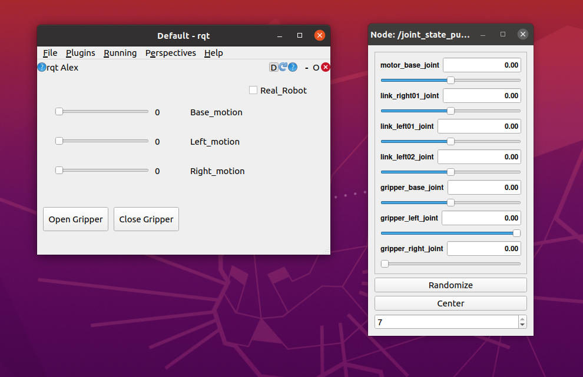

# Armpap
Armpa: Robotic arm 4DOF with ROS Noetic

This repository hosts the source code for the ROS < ARMPApP > package.

 

This is part of the practices that I am doing in the course Mastering Robot orerating System ROS in the ROBOCADEMY

## Description ##

The robot type is a open-hardware Arm with 4 degrees of freedom

- Arduino mega 2560.
- Ramps 1.4 by reprap.
- Driver A4988
- wifi with ESP8266.
- Motor Nema 17 24mm x 3.
- Planetary reduction gearbox 37:1
- Gripper Motor i2c.
- RGB Smart NeoPixel x 3.

### Contents ###

  - armpap_description : xacro files and meshes
  
  - armpap_control : Crontrol file, program to connect with the real robot and test with keyboard
  
  - armpap_gazebo : Simulation 
  
  - armpap_rqt_py : Plugin to control simulation and real robot
  
  - armpap_msg: specific ros messages for this type of robot.
  
  - pictures

## Key concepts covered ##
- the goal of this exercise is to get the xacro and urdf design of the robot, and to be able to simulate it in Gazebo. Also develop pluguins and drivers

- Modify the 3d arm model and add the 37: 1 reductions also printed.

  - [Reduction Source](https://www.thingiverse.com/thing:2071318)
  - [Arm Source](https://www.thingiverse.com/thing:480446)
  - [Gripper source](https://www.thingiverse.com/thing:920639)
    
  - Tools used, Sketchup, blender, netfabb, mesmixer
  
  

- Adapt the 3d model to simulate it. The real robot only has 4 motors, the base, right link, left link and the gripper. When creating the xacro we obtain 7 joints.
  
  - motor_base_joint    `real motor nema 17`
  - link_right01_joint  `real motor nema 17`
  - link_left01_joint   `real motor nema 17`
  - link_left02_joint   `passive joint related with link_right01_joint and link_left01_joint` 
  - gripper_base_joint  `passive joint related with link_right01_joint and link_left01_joint`
  - gripper_left_joint  `gripper motor i2c`
  - gripper_right_joint `gripper motor i2c`
  
  
  

  

- Create a Plugin in Python with QT
  
  - Use  Qt Designer to create ui.
  - Know how to use Button Widget.
  - Know how to use HorizontalSlider Widget.
  - Know how to use Checkbox Widget.
  - Know how to use label Widget.
  
  

   

## Usage ## 

To use the `armpap` package clone this repository into the `src` folder of your catkin workspace.

Then build the workspace with `catkin_make`.

Note: In my case the plugins is only compiled and appears when it is in the catkin_ws folder. If I add it to another work_space it doesn't appear.

   roslaunch armpap_description armpap_rviz.launch 

   roslaunch armpap_gazebo armpap_gazebo.launch   

   roslaunch armpap_control armpap_control.launch 
   
   
   
Executing rqt should appear the plugin, armpap_rpt, the sliders controls the movements of the robot and the buttons the gripper. If the checkbox is marked, it will also send the instructions to the real robot.

 
## Electronics ##
### Servo motor with I2C ### 

 
 
 **ServoMotor model for Ecology20 and detail of the interior circuit** 
 
The servomotor consists of a controller board with a PIC16f1503 and a LB1938FA driver, which drive a Pololu &quot;Micro-metal-gearmotors&quot; type reduction motor.

    - 100: 1, 130 rpm

### Driver ###

To control the stepper motors we use the A4988 driver or its equivalent DRV8825 both of pololu or similar

 [A4988](https://www.pololu.com/product/1182)
 
The idea was to continue using teensy 4.0 like the rest of the robots. So I designed a board to this purpose. But is time of Chinese New Year and that was going to bring a delay. So recycle lab stuff and use an arduino Mega 2560 and a Ramps 1.4 by reprap.

[Ramps 1.4](https://reprap.org/wiki/RAMPS_1.4/es)
[Arduino MEga 2560](https://store.arduino.cc/arduino-mega-2560-rev3)

 

 **DRV8825 is like A4988 but you can set it to 1:32 pulses versus 1:16 per step.** 
 
 
 

